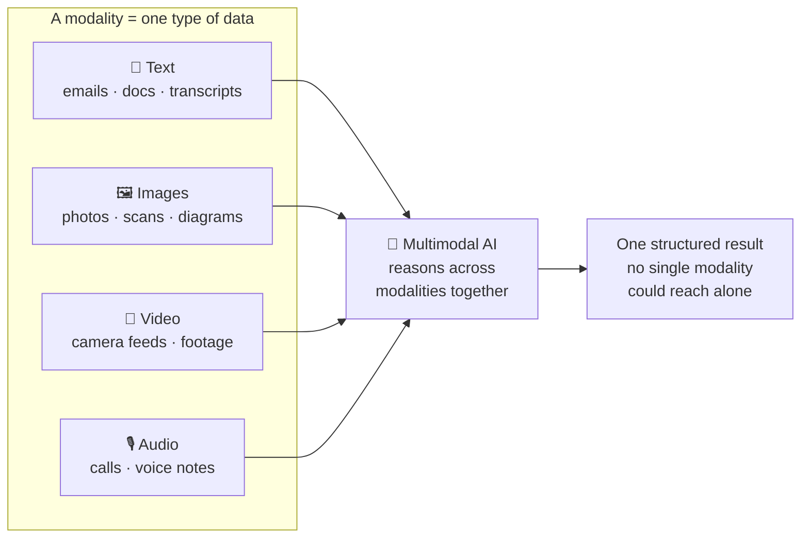
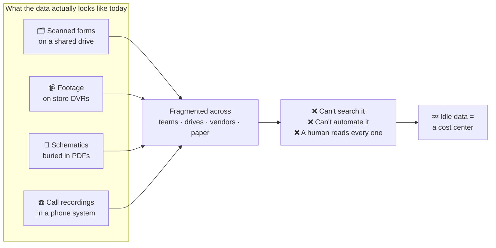
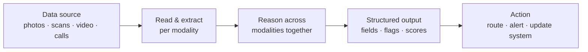
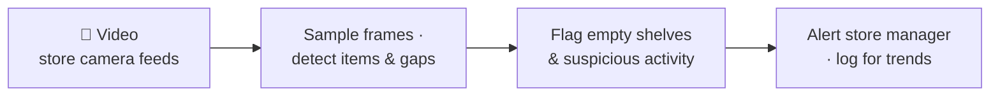
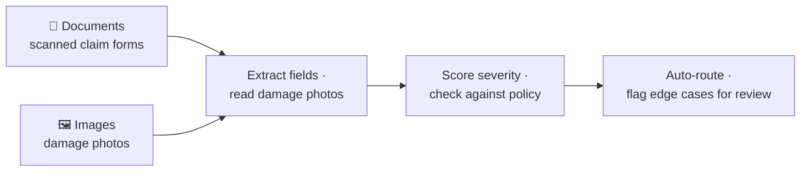
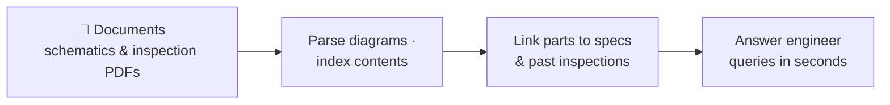
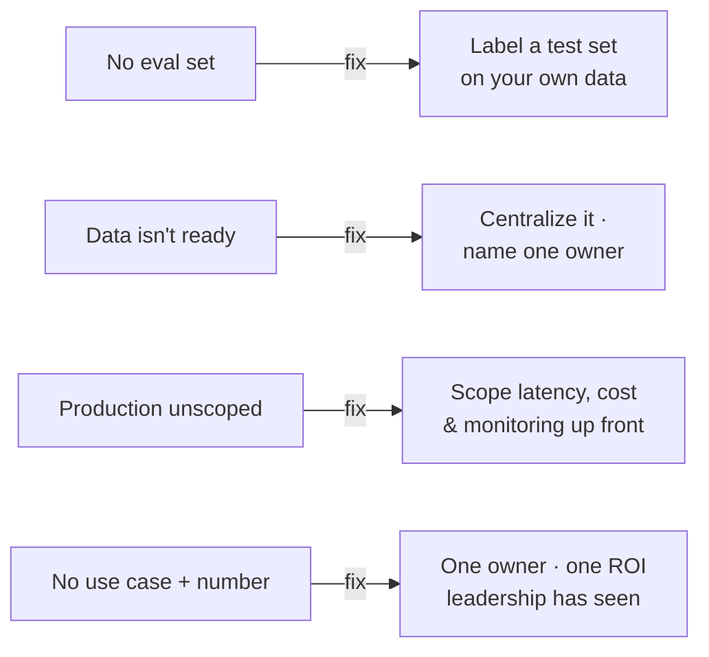
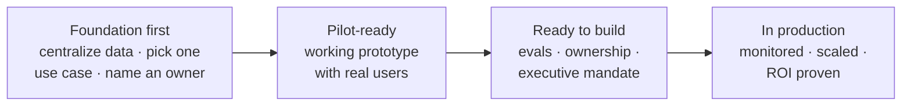
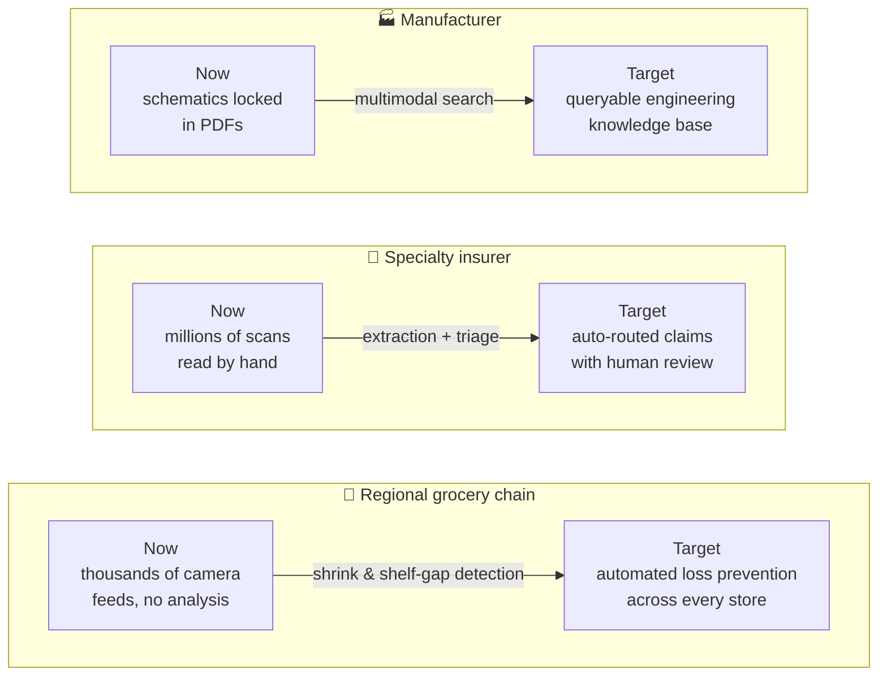

Most of the AI attention of the last few years has been about text: chatbots, summarizers, copilots. But the majority of the data businesses actually generate isn't text. It's **documents, photos, scanned forms, video, camera feeds, schematics, and diagrams.** Multimodal AI is what lets you put that data to work.

## The plain-English definition

**Multimodal AI is AI that can take in more than one _kind_ of input** — text, images, audio, video — and reason across them together.

A text-only model can read an insurance claim if someone has already typed it up. A multimodal model can look at the **photo of the damage**, read the **handwritten claim form**, cross-check the **policy document**, and produce a structured assessment — in one pass, the way a human adjuster would.

The "modality" is just the type of data:

- **Text** — emails, documents, transcripts
- **Images** — photos, scans, screenshots, diagrams
- **Video** — camera feeds, recorded footage
- **Audio** — calls, voice notes

Single-modal AI works within one of these. Multimodal AI works across several at once.

A **modality** is just one type of data. What makes a system **multimodal** isn't handling several types — it's reasoning across them *in the same pass* to reach a conclusion no single type could support on its own:

## Why it matters now

Two things changed. The models got good enough to read a messy real-world photo or a badly-scanned PDF reliably, and they got cheap enough to run at business scale. That combination is new.

For most companies the opportunity isn't "add a chatbot." It's the pile of visual and unstructured data they've been sitting on because, until recently, the only way to process it was to have a person look at it:

- A grocery chain with thousands of **camera feeds** and no way to spot shrink or empty shelves at scale.
- An insurer with **millions of scanned documents** that each need a human to read and route.
- A manufacturer with **schematics and inspection photos** locked in PDFs nobody can search.

The problem isn't that this data is missing — it's that each source lives somewhere different, in a format nobody can query. That **fragmentation** is what keeps it idle:

Multimodal AI turns that backlog from a cost center into something you can query, automate, and act on.

## What a multimodal workflow looks like

Under the hood these projects can get complex, but the useful ones almost always share the same simple shape: messy input of some **data type**, from a real **data source**, gets read, reasoned over, and turned into something a system can act on.

The value is in that last step. A model that merely _describes_ an image is a demo; a workflow that turns the image into a routed claim or a shelf alert is a product. Here's that same shape mapped onto three realistic scenarios — note how each starts from a specific data type and source, not from "AI."

Same skeleton every time. What changes is the data type coming in and the action going out — which is exactly why the hard part is rarely the model, and almost always the data and the use case around it.

## Where projects break

Here's the uncomfortable part: **most multimodal AI projects die between the demo and production.** A weekend prototype that looks magical is genuinely easy now. Turning it into something reliable, affordable, and monitored is where teams stall — usually for the same handful of reasons:

1. **No evaluation set.** If a vendor demos "95% accuracy," can you check that claim against _your_ data? Without a labeled test set, every demo is unfalsifiable.
2. **Data that isn't ready.** The images exist, but they're scattered across teams, drives, and vendors — or still on paper.
3. **Nobody scoped production.** Latency, cost per call, monitoring, and failure handling get discovered one painful quarter at a time, after the pilot.
4. **No clear use case with a number.** "We should be using AI" is not a use case. A use case has an owner and an ROI estimate leadership has seen.

None of these are model problems. They're readiness problems — and each one has a concrete fix you can do before spending real money on models:

These fixes are what the readiness path below sequences.

## Where teams are — and where they should be

Almost every company I talk to is already sitting on valuable data. It's just idle. The gap isn't the data or the models — it's the journey from "we have this" to "it runs in production." That path looks the same everywhere:

What that means concretely for three kinds of business — where they are today, and where the same data they already own could take them:

The pattern repeats: the raw material is already there. What's missing is the sequence to turn it into something production-grade — not a model, and not more data.

## The takeaway

Multimodal AI is the first time the data most businesses generate — visual, unstructured, messy — becomes directly useful to software. The technology is ready. The question is whether your **data, use cases, and team** are ready to ship it to production, not just demo it.

That gap between demo and production is exactly what a readiness assessment is for.
